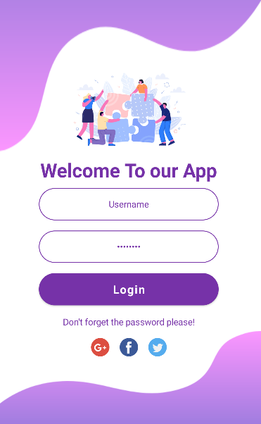

# SignIn Screen App
Mobile app Sign in Design using Jetpack Compose.

### Preview

Main elements of the screen:
- Beatuiful background images.
- Interactive TextFeild (ussername & password).
- Easy user interface design.
- Custom buttons.

## Contributing

1. Fork it (<https://github.com/tokhy1/SignIn_Screen.git/fork>)
2. Create your feature branch (`git checkout -b feature/fooBar`)
3. Commit your changes (`git commit -am 'Add some fooBar'`)
4. Push to the branch (`git push origin feature/fooBar`)
5. Create a new Pull Request

## Contact 
If you have any question or any suggestions, get in touch with me at mohamed21346587@gmail.com

Happy Coding!
